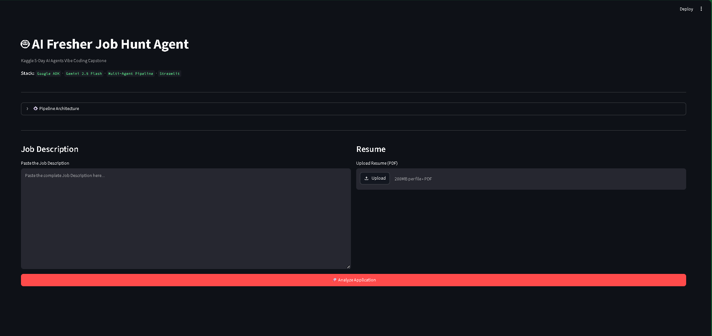
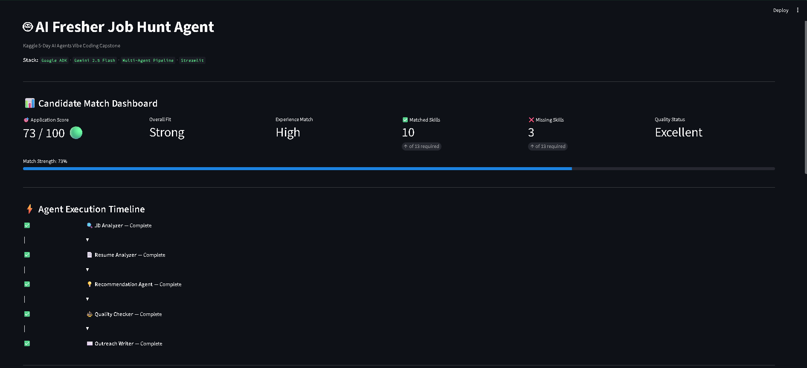
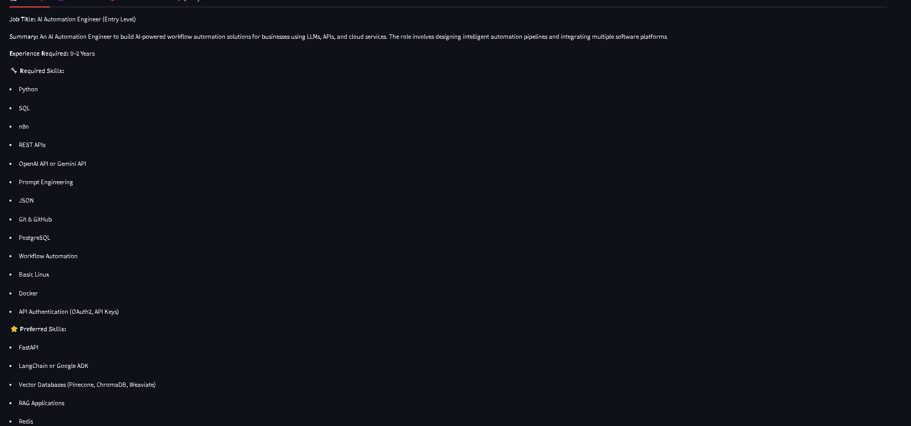
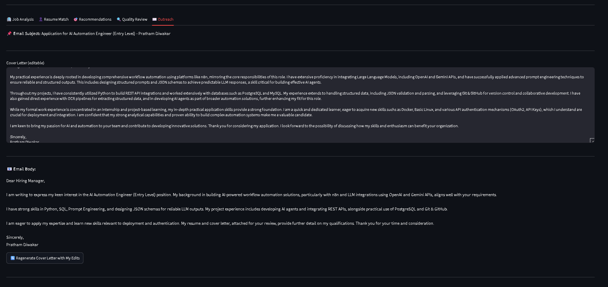
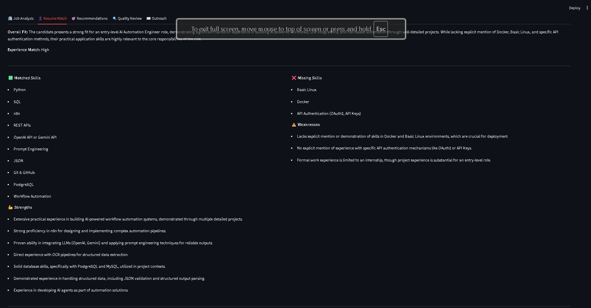
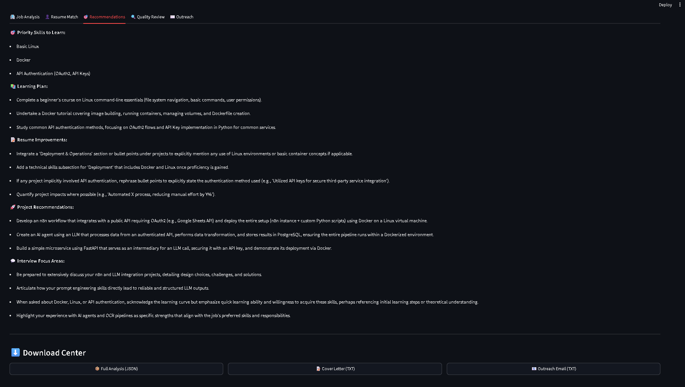
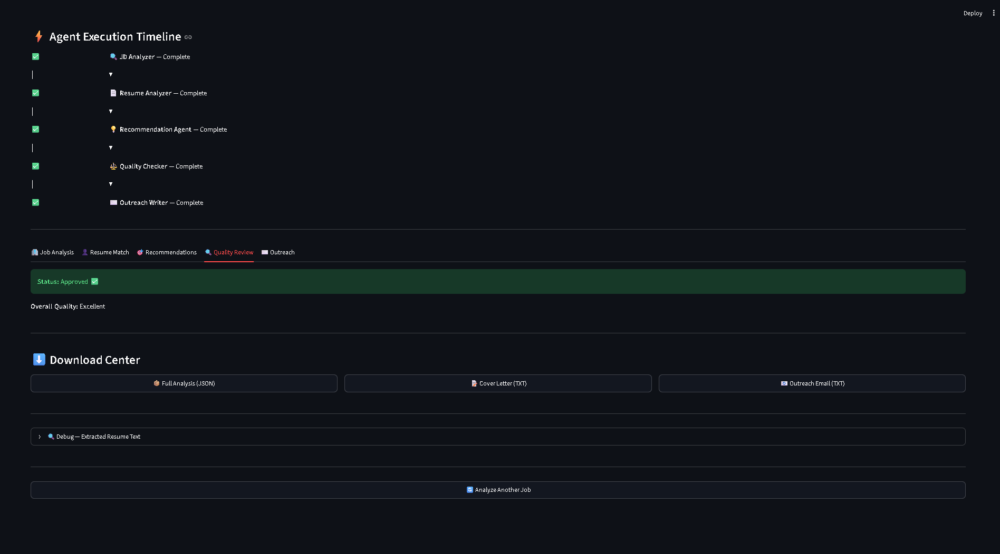
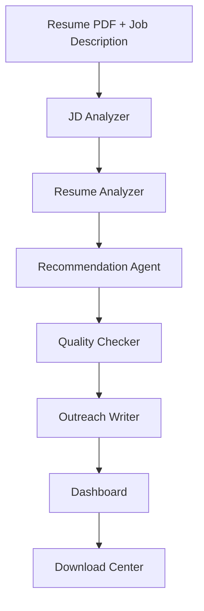

# 🤖 AI Fresher Job Hunt Agent

> **An AI-powered multi-agent career assistant built with Google Agent Development Kit (Google ADK), Gemini 2.5 Flash, and Streamlit that analyzes resumes against job descriptions, identifies skill gaps, and generates personalized recruiter outreach.**

<p align="center">


</p>

---

# 📌 Overview

AI Fresher Job Hunt Agent is a modular multi-agent application designed to help fresh graduates understand how well their resumes align with specific job descriptions.

Instead of relying on a single large prompt, the application decomposes the hiring workflow into multiple specialized AI agents. Each agent performs one well-defined task and passes structured JSON output to the next stage, resulting in a transparent, maintainable, and extensible pipeline.

The application provides:

- Resume-to-JD matching
- Skill gap analysis
- Personalized recommendations
- Quality validation
- Recruiter outreach generation
- Interactive human review
- Downloadable reports

Built as part of the **Kaggle Google AI Agents Vibe Coding Capstone**, the project demonstrates practical multi-agent orchestration using **Google ADK**.

---

# 🎥 Demo

# 🎥 Demo

### Home



---

### Candidate Match Dashboard



---

### Agent Execution Timeline



---

### Job Description Analysis



---

### Resume Match Analysis



---

### Recommendations Engine



---

### Outreach Generator



---


# ❓ Problem Statement

Modern recruitment has become increasingly automated, but job seekers often lack visibility into how their resumes are evaluated.

Common challenges include:

- Every company writes Job Descriptions differently.
- ATS systems filter resumes using hidden keyword matching.
- Fresh graduates rarely know which technical skills are actually missing.
- Generic cover letters reduce recruiter engagement.
- Manual resume tailoring is repetitive and time-consuming.

Candidates often spend hours modifying resumes without understanding what should actually change.

---

# 💡 Solution

This project addresses those challenges using a structured multi-agent workflow.

Instead of asking one LLM to perform every task, responsibilities are divided into specialized agents.

Each agent performs a single transformation:

- analyze the Job Description
- analyze the Resume
- compare both documents
- validate generated insights
- produce personalized recruiter outreach

Because every stage communicates using structured JSON, downstream agents operate on verified information rather than free-form text, improving consistency and maintainability.

---

# ✨ Key Features

## 🔍 Job Description Analysis

Extracts

- Required skills
- Preferred skills
- Responsibilities
- Experience requirements
- Job summary

---

## 📄 Resume Analysis

Identifies

- Matched skills
- Missing skills
- Strengths
- Weaknesses
- Overall fit
- Experience alignment

---

## 🎯 Personalized Recommendations

Generates

- Missing technical skills
- Learning priorities
- Resume improvements
- Suggested portfolio projects
- Interview preparation focus

---

## ⚖️ Quality Assurance Agent

Introduces an additional validation layer before outreach generation.

The Quality Checker reviews previous agent outputs and evaluates:

- Completeness
- Consistency
- Actionability
- Overall output quality

---

## ✉️ Human-in-the-Loop Outreach

Generates

- ATS-friendly Cover Letter
- Recruiter Email

Users can edit generated content and regenerate outreach without restarting the complete pipeline.

---

## 📊 Candidate Dashboard

Displays

- Application Score
- Overall Fit
- Experience Match
- Matched Skills
- Missing Skills
- Quality Status

---

## ⚡ Execution Timeline

Visualizes the progress of every AI agent during execution, making the workflow transparent and easier to understand.

---

## ⬇️ Download Center

Export results as

- JSON
- Cover Letter
- Recruiter Email

---

# 🏗️ System Architecture

```text
                 User
                   │
                   ▼
         Streamlit Interface
                   │
                   ▼
       JobHuntOrchestrator
                   │
        Sequential Pipeline
                   │
 ┌─────────────────────────────────┐
 │                                 │
 ▼                                 │
 JD Analyzer                       │
 │                                 │
 ▼                                 │
 Resume Analyzer                   │
 │                                 │
 ▼                                 │
 Recommendation Agent              │
 │                                 │
 ▼                                 │
 Quality Checker                   │
 │                                 │
 ▼                                 │
 Outreach Writer                   │
 └─────────────────────────────────┘
                   │
                   ▼
         Streamlit Dashboard
```

---

# 🤖 Multi-Agent Workflow



---

# 🧠 AI Pipeline

```text
Resume PDF
        │
        ▼
PDF Text Extraction
        │
        ▼
Job Description Analysis
        │
        ▼
Resume Analysis
        │
        ▼
Skill Gap Detection
        │
        ▼
Recommendation Generation
        │
        ▼
Quality Validation
        │
        ▼
Recruiter Outreach Generation
        │
        ▼
Dashboard Rendering
        │
        ▼
Downloadable Reports
```

---

# 🎯 Why Multi-Agent Instead of One Prompt?

A single LLM prompt attempting to perform resume parsing, job matching, recommendation generation, validation, and outreach writing becomes difficult to maintain and debug.

This project instead adopts a **single-responsibility multi-agent architecture**.

Benefits include:

- Better separation of concerns
- Easier debugging
- Reusable prompt design
- Structured intermediate outputs
- Independent quality validation
- Easier future expansion

Each agent focuses on one responsibility, making the overall system more modular and maintainable.

---

# 🛠️ Technology Stack

| Layer | Technology | Purpose |
|-------|------------|---------|
| Language | Python 3.11+ | Core application development |
| Agent Framework | Google Agent Development Kit (Google ADK) | Multi-agent orchestration |
| LLM | Gemini 2.5 Flash | Natural language reasoning |
| UI | Streamlit | Interactive web interface |
| PDF Processing | PyPDF2 / pypdf | Resume text extraction |
| Package Manager | uv | Dependency management |
| Configuration | python-dotenv | Environment variables |
| Data Exchange | JSON | Structured communication between agents |

---

# 📂 Project Structure

```text
ai-job-hunt-agent/
│
├── agents/
│   ├── agent.py
│   ├── jd_analyzer.py
│   ├── resume_analyzer.py
│   ├── recommendation.py
│   ├── quality_checker.py
│   └── outreach_writer.py
│
├── coordinator/
│   └── orchestrator.py
│
├── prompts/
│   ├── jd_prompt.py
│   ├── resume_prompt.py
│   ├── recommendation_prompt.py
│   ├── quality_prompt.py
│   ├── outreach_prompt.py
│   └── __init__.py
│
├── tools/
│   └── pdf_reader.py
│
├── utils/
│   ├── constants.py
│   ├── helper.py
│   ├── logger.py
│   └── parser.py
│
├── app.py
├── pyproject.toml
└── README.md
```

---

# 🤖 Agent Breakdown

The application is organized around five specialized AI agents. Each agent performs a single responsibility and communicates with the next stage using structured JSON.

---

## 🔍 Agent 1 — Job Description Analyzer

### Responsibility

Extract structured information from a raw job description.

### Input

- Raw Job Description

### Output

- Job Title
- Required Skills
- Preferred Skills
- Responsibilities
- Experience Requirements
- Job Summary

### Why it exists

Separating JD understanding from resume analysis reduces prompt complexity and allows downstream agents to operate on normalized structured data.

---

## 📄 Agent 2 — Resume Analyzer

### Responsibility

Evaluate how well the uploaded resume aligns with the analyzed Job Description.

### Input

- Structured JD Analysis
- Resume Text

### Output

- Matched Skills
- Missing Skills
- Strengths
- Weaknesses
- Overall Fit
- Experience Match
- Application Score

### Why it exists

Instead of simply extracting resume information, this agent performs contextual comparison against the target role.

---

## 💡 Agent 3 — Recommendation Agent

### Responsibility

Transform resume analysis into actionable career advice.

### Input

- JD Analysis
- Resume Analysis

### Output

- Priority Skills
- Learning Plan
- Resume Improvements
- Suggested Projects
- Interview Focus Areas

### Why it exists

This stage bridges analysis and action by generating practical recommendations tailored to the candidate.

---

## ⚖️ Agent 4 — Quality Checker

### Responsibility

Validate outputs generated by previous agents before outreach generation.

### Input

- JD Analysis
- Resume Analysis
- Recommendations

### Output

- Overall Quality
- Approval Status
- Issues Found
- Suggestions

### Why it exists

Adding an independent validation layer improves consistency and encourages higher-quality downstream outputs.

---

## ✉️ Agent 5 — Outreach Writer

### Responsibility

Generate recruiter-facing communication based on validated analysis.

### Input

- JD Analysis
- Resume Analysis
- Recommendations
- Quality Review

### Output

- Email Subject
- Recruiter Email
- Personalized Cover Letter

### Why it exists

Keeping outreach generation isolated enables users to regenerate only this stage after editing, without rerunning the complete pipeline.

---

# 🔄 Pipeline Execution

The application follows a sequential execution model coordinated by the `JobHuntOrchestrator`.

```text
User Input
     │
     ▼
JD Analyzer
     │
     ▼
Resume Analyzer
     │
     ▼
Recommendation Agent
     │
     ▼
Quality Checker
     │
     ▼
Outreach Writer
     │
     ▼
Streamlit Dashboard
```

Each stage receives structured JSON from the previous stage, reducing ambiguity and making intermediate outputs easier to inspect and debug.

---

# 📝 Prompt Engineering Strategy

Each agent uses an independent system prompt designed specifically for its responsibility.

Prompt design principles include:

- Single-responsibility prompts
- Structured JSON output
- Clear role definitions
- Reduced prompt ambiguity
- Downstream compatibility
- Human-readable intermediate outputs

This modular approach simplifies prompt maintenance and allows each agent to evolve independently.

---

# 📦 Structured JSON Communication

Instead of passing free-form text between agents, the pipeline exchanges structured JSON objects.

Example flow:

```text
Job Description
      │
      ▼
JD JSON
      │
      ▼
Resume JSON
      │
      ▼
Recommendation JSON
      │
      ▼
Quality JSON
      │
      ▼
Outreach JSON
```

Benefits include:

- Consistent data formats
- Easier parsing
- Better debugging
- Cleaner orchestration
- Reduced downstream ambiguity

---

# ⚙️ Engineering Decisions

## Why Google ADK?

Google ADK provides reusable abstractions for AI agents and simplifies orchestration without requiring custom execution frameworks.

---

## Why Multiple Agents?

Breaking responsibilities into specialized agents improves maintainability, readability, and extensibility compared to a single monolithic prompt.

---

## Why JSON Outputs?

Structured outputs make it easier for downstream agents to consume information and reduce parsing complexity.

---

## Why Streamlit?

Streamlit enables rapid development of an interactive interface while keeping the focus on AI workflow implementation rather than frontend engineering.

---

## Why an Orchestrator?

The orchestrator centralizes pipeline execution, session management, asynchronous agent execution, and result aggregation, keeping individual agents independent.

---

# 📈 Candidate Dashboard

The dashboard summarizes pipeline outputs using visual metrics.

Displayed information includes:

- Application Score
- Overall Fit
- Experience Match
- Matched Skills
- Missing Skills
- Quality Status

This provides candidates with an immediate overview before reviewing detailed analysis.

---

# ⚡ Agent Execution Timeline

The interface visualizes pipeline progress by displaying completed stages in execution order.

Benefits:

- Improves transparency
- Helps users understand pipeline flow
- Makes debugging easier
- Demonstrates multi-agent execution visually

---

# 👤 Human-in-the-Loop Workflow

Instead of locking generated outreach, the application allows users to review and edit generated content.

Users can:

- Modify the generated cover letter
- Request regeneration
- Iterate without rerunning the complete pipeline

This combines AI automation with human judgment.

---

# 🚀 Installation

## Clone Repository

```bash
git clone https://github.com/diwakar7619/ai-job-hunt-agent.git
cd ai-job-hunt-agent
```

---

## Install Dependencies

```bash
uv sync
```

---

## Configure Environment

Create a `.env` file.

```env
GOOGLE_API_KEY=YOUR_API_KEY
```

---

## Run Application

```bash
streamlit run app.py
```

Open your browser at:

```
http://localhost:8501
```

---

# 💻 Usage

1. Launch the Streamlit application.
2. Paste a Job Description.
3. Upload a Resume PDF.
4. Click **Analyze Application**.
5. Review dashboard metrics.
6. Explore each analysis tab.
7. Edit generated outreach if needed.
8. Download results.

---

# 📸 Screenshots

Add screenshots from your project here.

Recommended images:

- Home Page
- Candidate Dashboard
- Resume Analysis
- Recommendations
- Quality Review
- Outreach
- Execution Timeline
- Download Center

Use descriptive filenames such as:

```text
assets/home.png
assets/dashboard.png
assets/recommendations.png
assets/quality-review.png
assets/outreach.png
```

---

# 🔒 Security Considerations

Although this project is intended as a portfolio application, several engineering practices have been incorporated to improve reliability and safety.

### Input Validation

The application validates user inputs before pipeline execution.

Examples include:

- Empty Job Description detection
- Empty Resume detection
- Resume size limits
- Maximum Job Description length

These checks help prevent unnecessary LLM requests and improve overall user experience.

---

### Environment Variables

Sensitive credentials are never hardcoded.

API keys are loaded through a `.env` file using `python-dotenv`.

Example:

```env
GOOGLE_API_KEY=YOUR_API_KEY
```

---

### Secret Management

The repository excludes:

- `.env`
- Virtual environments
- Cache directories
- Local session files

through `.gitignore`.

---

### Structured Outputs

Every AI agent returns structured JSON.

Advantages include:

- Easier validation
- Cleaner parsing
- Lower risk of malformed downstream inputs
- Improved debugging

---

# ⚠️ Error Handling

The application includes defensive handling for common runtime failures.

Examples include:

- Invalid PDF uploads
- JSON parsing failures
- Missing fields
- Empty model outputs
- Gemini quota errors
- Async execution failures

The orchestrator isolates each stage, making failures easier to identify and debug.

---

# 🧪 Testing

Basic verification can be performed from the terminal.

Verify imports:

```bash
uv run python -c "from agents.agent import *; print('All agents imported successfully')"
```

Verify orchestrator:

```bash
uv run python -c "from coordinator.orchestrator import JobHuntOrchestrator; print([a.name for a in JobHuntOrchestrator().get_pipeline()])"
```

Compile project:

```bash
uv run python -m compileall .
```

Launch application:

```bash
streamlit run app.py
```

---

# 📊 Example Workflow

```
Paste Job Description
        │
        ▼
Upload Resume
        │
        ▼
Analyze Application
        │
        ▼
JD Analysis
        │
        ▼
Resume Analysis
        │
        ▼
Recommendations
        │
        ▼
Quality Review
        │
        ▼
Generate Outreach
        │
        ▼
Download Results
```

---

# 📁 Output Artifacts

The application can generate:

- Structured JSON analysis
- Personalized Cover Letter
- Recruiter Email

These can be downloaded directly from the interface.

---

# 🧠 Engineering Highlights

This project emphasizes software engineering practices in addition to AI capabilities.

Highlights include:

- Modular architecture
- Single-responsibility agents
- Centralized orchestration
- Structured JSON communication
- Prompt separation from business logic
- Reusable helper utilities
- Logging utilities
- Safe JSON parsing
- Human-in-the-loop workflow
- Interactive dashboard
- Downloadable reports

---

# 🏆 Competition Alignment

This project was built for the **Kaggle Google AI Agents Vibe Coding Capstone** and demonstrates several concepts encouraged by the competition.

### ✔ Multi-Agent Architecture

Five specialized AI agents collaborate through a sequential pipeline.

---

### ✔ Agent Orchestration

A dedicated orchestrator coordinates execution, manages sessions, and aggregates results.

---

### ✔ Human-in-the-Loop

Users can review and refine generated outreach before using it.

---

### ✔ Structured AI Outputs

Agents communicate using structured JSON instead of free-form text.

---

### ✔ Interactive Interface

The Streamlit application provides:

- Dashboard
- Agent Timeline
- Analysis Tabs
- Download Center

---

### ✔ Modular Design

Each component can be modified independently without affecting the rest of the system.

---

# ⚖️ Design Trade-offs

Like any engineering project, this implementation makes deliberate trade-offs.

| Decision | Benefit | Trade-off |
|----------|----------|-----------|
| Sequential Agents | Easier debugging | Higher latency |
| JSON Communication | Reliable data exchange | Slightly larger prompts |
| Streamlit | Rapid development | Limited UI customization |
| Google ADK | Simplified orchestration | Requires Gemini API |

Understanding these trade-offs helps explain why the system was designed this way.

---

# 🚧 Current Limitations

The project is intentionally scoped for demonstration purposes.

Current limitations include:

- Requires a valid Gemini API key
- Sequential execution increases total response time
- No persistent user accounts
- No resume history
- No application tracking
- No cloud deployment configuration included

These decisions keep the codebase focused on demonstrating multi-agent orchestration.

---

# 🔮 Future Roadmap

Planned improvements include:

- Resume version comparison
- Application history
- Job URL parsing
- Automatic Job Description scraping
- Vector database integration
- RAG-enhanced recommendations
- Interview preparation agent
- Resume optimization agent
- Application tracker dashboard
- Cloud deployment

---

# 📚 Lessons Learned

Building this project reinforced several engineering principles.

Key takeaways include:

- Multi-agent systems are easier to maintain than monolithic prompts.
- Structured outputs simplify downstream processing.
- Prompt design significantly impacts output quality.
- Modular architecture improves extensibility.
- Human review remains valuable even in AI-assisted workflows.

---

# 🙏 Acknowledgements

This project was built using several excellent open-source technologies.

- Google Agent Development Kit (Google ADK)
- Google Gemini
- Streamlit
- PyPDF2 / pypdf
- python-dotenv
- uv

Special thanks to the **Google AI** and **Kaggle** teams for organizing the AI Agents Vibe Coding Capstone.

---

# 🤝 Contributing

Contributions are welcome.

If you would like to improve the project:

1. Fork the repository
2. Create a feature branch
3. Commit your changes
4. Submit a pull request

Please ensure code remains modular and consistent with the existing project structure.

---

# 📄 License

This repository is currently provided for educational and portfolio purposes.

If you intend to open-source the project, consider adding an MIT License.

---

# 👨‍💻 Author

**Pratham Diwakar**

B.Tech Computer Science Engineer (2025)

Passionate about AI Engineering, Multi-Agent Systems, and Intelligent Automation.

GitHub:
https://github.com/diwakar7619

LinkedIn:
*(Add your LinkedIn profile here)*

---

# ⭐ If you found this project useful...

Consider giving the repository a ⭐ on GitHub.

Feedback, suggestions, and contributions are always appreciated.